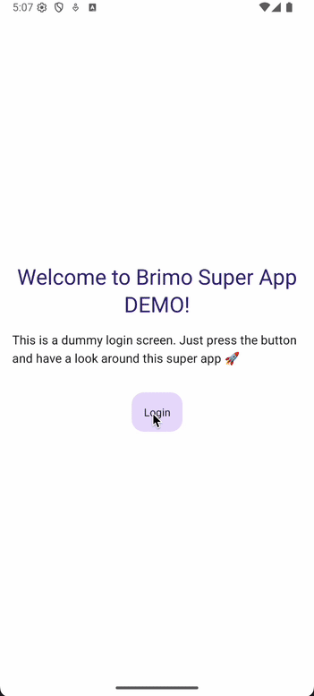
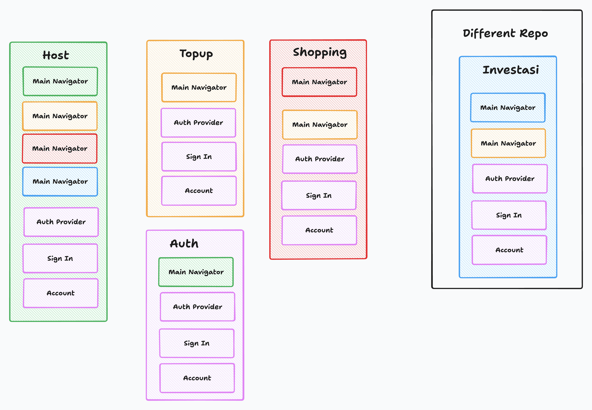

# Brimo Super App Demo

This repository demonstrates a micro-frontend architecture for React Native using Module Federation with Re.Pack and Rspack. The super app consists of a host application that dynamically loads multiple mini applications.




## Architecture Overview

The super app follows a micro-frontend architecture where:
- **Host App** (`packages/host`) - The main application that orchestrates and loads mini apps
- **Mini Apps** - Independent applications that can be loaded into the host
- **SDK** (`packages/sdk`) - Shared utilities and dependency management

## App Dependencies Diagram

The following diagram shows the relationship between the host app and various mini apps:




## Package Structure

### 📁 packages/
- **`host/`** - Main host application that loads and orchestrates mini apps
- **`topup/`** - Top-up/recharge functionality mini app
- **`shopping/`** - E-commerce shopping mini app
- **`auth/`** - Authentication mini app
- **`sdk/`** - Shared SDK for dependency management and utilities

## Mini Apps Configuration

### Local Mini Apps

Each mini app in this repository is configured to run on its own port and expose its functionality through Module Federation:

| App | Port | Location | Purpose |
|-----|------|----------|---------|
| **TopUp** | 9000 | `packages/topup` | Topup Mini App |
| **Shopping** | 9001 | `packages/shopping` | Shoping mini app |
| **Auth** | 9003 | `packages/auth` | Auth mini app |
| **Investasi** | 9004 | https://github.com/feedloop/brimo-investasi-mini-app-demo External mini app | Investasi Mini App |

### External Mini Apps

#### 📈 Investasi App - External Repository Integration

The **Investasi** (Investment) app is a special case that demonstrates how to integrate mini apps from external repositories:

- **Repository**: Hosted in a separate repository (not included in this monorepo)
- **Port**: 9004
- **Integration**: Configured through the host app's `rspack.config.mjs`

#### How External Apps Are Loaded

The Investasi app is defined as a remote module in the host application's configuration:

```javascript
// packages/host/rspack.config.mjs
new Repack.plugins.ModuleFederationPluginV2({
  name: 'host',
  remotes: {
    topup: `topup@http://localhost:9000/${platform}/mf-manifest.json`,
    shopping: `shopping@http://localhost:9001/${platform}/mf-manifest.json`,
    auth: `auth@http://localhost:9003/${platform}/mf-manifest.json`,
    investasi: `investasi@http://localhost:9004/${platform}/mf-manifest.json`, // External app
  },
  shared: getSharedDependencies({eager: true}),
})
```

This configuration allows the host app to:
1. **Dynamically load** the Investasi app from `http://localhost:9004`
2. **Share dependencies** through the SDK to avoid duplication
3. **Maintain loose coupling** between the host and external mini apps

## Technology Stack

- **React Native 0.78.2** - Mobile app framework
- **Re.Pack 5.1.0** - Webpack alternative for React Native with Module Federation support
- **Rspack** - Fast bundler compatible with webpack ecosystem
- **Module Federation** - Micro-frontend architecture implementation
- **TypeScript** - Type safety and better developer experience

## Development Workflow

### Running the Super App

1. **Start all apps together** (recommended):
   ```bash
   # Start host app with all local mini apps
   pnpm start
   ```

2. **Start per platform**:
   ```bash
   # For Android
   pnpm run:host:android

   # For iOS
   pnpm run:host:ios
   ```

3. **Start the external Investasi app** (optional):

   In the [Investasi app repository](https://github.com/feedloop/brimo-investasi-mini-app-demo):

   ```bash
   pnpm start
   ```

### Key Benefits

- **Independent Development**: Teams can work on mini apps independently
- **Scalable Architecture**: Easy to add new mini apps or remove existing ones
- **Shared Dependencies**: Common libraries are shared through the SDK
- **External Integration**: Support for mini apps from different repositories
- **Hot Reloading**: Each mini app can be developed and tested in isolation

## External Repository Integration

The Investasi app demonstrates how external teams can:

1. **Develop independently** in their own repository
2. **Expose their app** through Module Federation
3. **Integrate seamlessly** with the host app by running on the configured port (9004)
4. **Share dependencies** through the common SDK

This pattern enables large organizations to have distributed teams working on different features while maintaining a cohesive user experience in the super app.
